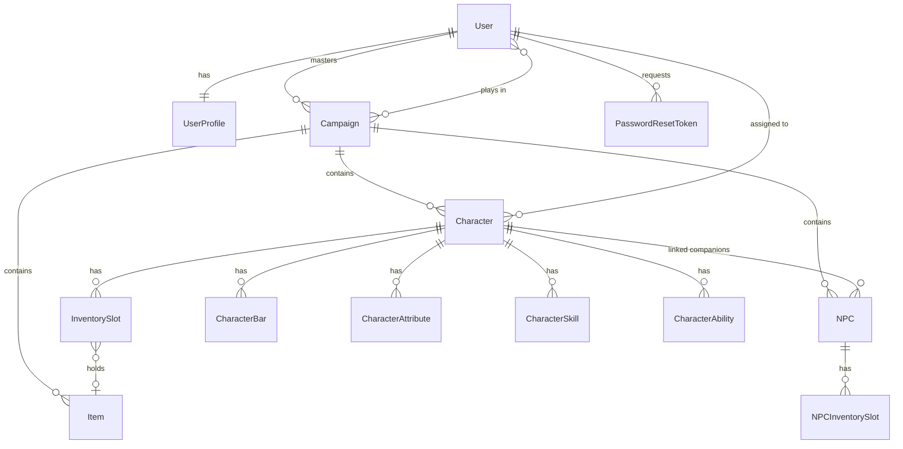

> 🇧🇷 [Português](data-model.pt-BR.md) · 🇬🇧 **English**

# Data Model

All models live in `hud/models.py`. Everything is scoped to a **campaign**,
which is the aggregate root of the domain.



## Campaign

The container everything else hangs from.

| Field | Notes |
|---|---|
| `name`, `description` | |
| `banner` | Optional image (`campaigns/`) |
| `master` | FK to user — **the only account with edit rights** |
| `players` | M2M to users; the master is added automatically on creation |
| `created_at`, `updated_at` | Ordered newest first |

Deleting a campaign cascades to its characters, NPCs and items — hence the
exact-name confirmation in the UI.

## UserProfile

Created automatically by a `post_save` signal on `User`.

| Field | Notes |
|---|---|
| `role` | `MASTER` / `PLAYER` — **legacy**, real authorization is per campaign |
| `display_name` | Full name shown in the UI |
| `nickname` | Used by the player search |
| `avatar` | Optional image (`avatars/`) |

## Character and NPC

`Character` and `NPC` are structurally twins — same stats, same inventory
mechanics, same sheet sub-entities. They differ in ownership and default
visibility:

| | Character | NPC |
|---|---|---|
| Belongs to | Campaign | Campaign |
| Controlled by | A player (`assigned_to`) | The master |
| `visible` default | `True` | `False` |
| Extra link | — | `assigned_to_character` (companion of a character) |

Shared fields: `name`, `image`, `image_zoom`/`image_focus_x`/`image_focus_y`,
`hp_max`/`hp_current`, `sp_max`/`sp_current`, `inventory_capacity` (default 16),
`created_by`, timestamps.

The three image fields come from the abstract `RetratoEnquadrado` class and hold
the portrait **framing**: the zoom (100 to 400) and the point of the photo that
sits at the centre of the frame (0 to 1 on each axis). Without them the frame
would have to crop through the middle, and the geometric middle is rarely the
face. The crop lives in the database rather than in the uploader's browser
because the player has to see the sheet framed the way the master chose.
Replacing the photo resets all three: the crop belonged to the old image.

### The character's three portraits

Only `Character` has `image_ferido` and `image_grave` — the same person with a different face. They are fields on the sheet rather than a second sheet with the name, bars and inventory duplicated.

Which of the three shows is **not a field**: it comes from health, and health is the **first bar on the sheet**. `estado_do_retrato` divides `current` by `max_value` of `barra_de_vida`: up to a quarter is `GRAVE`, up to a half is `FERIDO`, anything above that is `INTEIRO`. Storing the state in a column would mean keeping it current on every damage click across three different routes, and the first one to forget would leave the face lying about the bar right below it.

There is no field saying "this bar is health" because there would be no way to fill it in for sheets that already exist — and because the order is already a choice the master makes on screen: they drag the bar that counts to the top. A sheet with no bars stays `INTEIRO`.

`retrato_atual` picks the image for the state and **falls back upward** when it is missing: `GRAVE` uses the wounded art, and wounded uses the whole portrait. So a single upload is enough, and an old sheet stays exactly as it was. `NPC` and `Enemy` carry the same property returning plain `image`, so board pieces go through one template without knowing who has states.

The **framing is shared** by all three: they are portraits of the same person, almost always in the same shape, and three sets of zoom and focus point (plus three more for the card) would add eight columns and another on-screen selector to solve a problem that has not shown up yet.

### Bars: health can go past the maximum

`CharacterBar`, `NPCBar` and `EnemyBar` are the same table three times (`name`, `current`, `max_value`, `color`, `order`) and share the `BarraDeFicha` mixin — a mixin of properties rather than an abstract model, because the three tables already exist with these columns and turning them into inheritance would touch migrations without changing a single row.

`current` is **not capped by `max_value`**. The ability that grants temporary hit points leaves the character at 15/12, and clamping at 12 would erase exactly what it did. The track shows the difference in two pieces: at 15/12 it now stands for 15, the 12 of real health take 80% of it (`fatia_base`) and the 3 of overflow take the rest (`fatia_excedente`). The floor is still zero.

The overflow uses the colour returned by `cor_oposta()`: the bar's hue rotated 180 degrees, with a floor on saturation and lightness. It is **another colour, not another shade of the same one** — a lighter red chunk on a red bar reads as "more of the same", which is the opposite of what it means; and without the floor the opposite of a grey would be another grey, lost inside the track.

Three invariants are enforced in `save()`:

- **`clamp_stats()`** — `hp_current` and `sp_current` can never exceed their
  maximum, no matter what a form or endpoint sends.
- **`clamp_framing()`** — the zoom stays between 100 and 400 and the focus
  point between 0 and 1.
- **`ensure_slots()`** — the inventory always has exactly
  `inventory_capacity` slots (see below).

> The `hp_*` / `sp_*` fields are the original stat system. Migration
> `0010_migrate_hp_sp_to_bars` moved them into the generic **bar** system;
> the columns are kept for compatibility with existing data and the
> `modify_hp` / `modify_sp` endpoints.

## Sheet sub-entities

Each of these exists in a `Character…` and an `NPC…` flavor, all ordered by
`order` then `name`:

| Model | Fields | Purpose |
|---|---|---|
| `…Bar` | `name`, `current`, `max_value`, `color` | Custom resources (HP, mana, sanity…) |
| `…Attribute` | `name`, `value` | Free-form stats (STR, DEX…) |
| `…Skill` | `name`, `value` (optional) | Proficiencies |
| `…Ability` | `name` | Named abilities |

Values are `CharField`, not numbers, on purpose: different systems write
attributes as `18`, `+3` or `d8`, and the panel does not interpret them.

## Enemy

`Enemy` is the third sheet, and the shortest: same framed portrait, same bars,
attributes, skills and abilities as `Character` and `NPC` — **no inventory**. An
enemy carries no bag; whatever it drops becomes a campaign item through the
master. There is no `inventory_capacity`, no `ensure_slots()`, no slot table.

It also does not inherit the `hp_*`/`sp_*` fields: those exist on the other two
only for compatibility with pre-bar data, and a new sheet need not carry that
debt.

It is born with `visible = False`. The master reveals it when the table should
see the health bar of whatever is in front of them; while hidden, a player of
the campaign still gets a 403. The sub-entities (`EnemySkill`, `EnemyAbility`,
`EnemyBar`, `EnemyAttribute`) follow the same shape as the NPC ones.

## The campaign board

The master lays the session out on a board: characters, NPCs, enemies and
polaroids stay where they were dropped, and everyone's bars go up and down
without leaving it.

Position comes from the abstract `PecaDoQuadro` class (`board_x`, `board_y`),
inherited by `Character`, `NPC`, `Enemy` and `Polaroid`. It is a **fraction of
the board (0 to 1), not a pixel**: the master arranges the table on the big
monitor and the same arrangement holds up on a laptop. `NULL` means "never
dragged" — the view lays those out on a grid when the board opens, storing
nothing; a position only becomes a number in the database once someone actually
drags the piece.

`Polaroid` is the piece that is nobody's sheet: the dungeon map, the note the
thief left behind. It has an image (framed like the sheets), a caption, and
`tilt` — the tilt in degrees, between −8 and 8. That lives in the database
rather than in a CSS `random` because a board that reshuffles its angles on
every reload is tiring to look at.

`StickyNote` is the post-it: text only, written in place. It is born empty, with
no form — a post-it exists for whatever the master remembered mid-session and
does not want to lose, and the path from remembering to writing has to be one
click. The text saves itself (700 ms debounce, plus on `blur`); it keeps a
`color` (one of four from a list, cycled on creation rather than drawn at
random, because two identical ones in a row read as a bug) and a `tilt` between
−6 and 6.

The board is the master's alone: the whole tab lives inside the
`` branch, so a player's HTML never even contains the pieces,
and `?mode=player` does not build them either. And only what is already revealed
(`visible=True`) gets onto it — while the table cannot see something, it is not
in play, and the master handles what is still a secret from that type's own tab.

The bar buttons send `amount` alongside `action`, and all three endpoints
(`modify_bar`, `modify_npc_bar`, `modify_enemy_bar`) step by that much — with a
floor of 1, since a negative `amount` would otherwise invert the action and
make `decrease` heal.

## Item and inventory slots

`Item` is campaign-scoped and shared: the same item row can sit in several
inventories, because slots reference it by FK.

`InventorySlot` / `NPCInventorySlot`:

| Field | Notes |
|---|---|
| `character` / `npc` | Owner |
| `position` | 1-based; `unique_together` with the owner |
| `item` | Nullable — `SET_NULL`, so deleting an item empties the slot instead of destroying it |

Layout helpers (`row`, `col`) derive the grid position from
`INVENTORY_COLUMNS = 4`, which is why the UI renders a 4-wide grid without
storing coordinates.

### The `ensure_slots()` contract

```python
existing = set(self.slots.values_list("position", flat=True))
missing  = [p for p in range(1, self.inventory_capacity + 1) if p not in existing]
# bulk_create(missing, ignore_conflicts=True)
# then: delete slots with position > inventory_capacity
```

Consequences worth knowing:

- Slots are **always** materialized in the database, never rendered as
  virtual placeholders — the template can iterate `character.slots` directly.
- **Shrinking capacity deletes the excess slots**, and any item sitting in
  them is unassigned (the `Item` row itself survives).
- The method is safe to call repeatedly (`ignore_conflicts=True`).

## PasswordResetToken

| Field | Notes |
|---|---|
| `user` | FK |
| `token` | Unique random string used in the reset URL |
| `created_at`, `expires_at` | Expiry checked at redeem time |
| `used` | Single-use flag |

Tokens are never deleted after use, which leaves an audit trail of reset
attempts.
