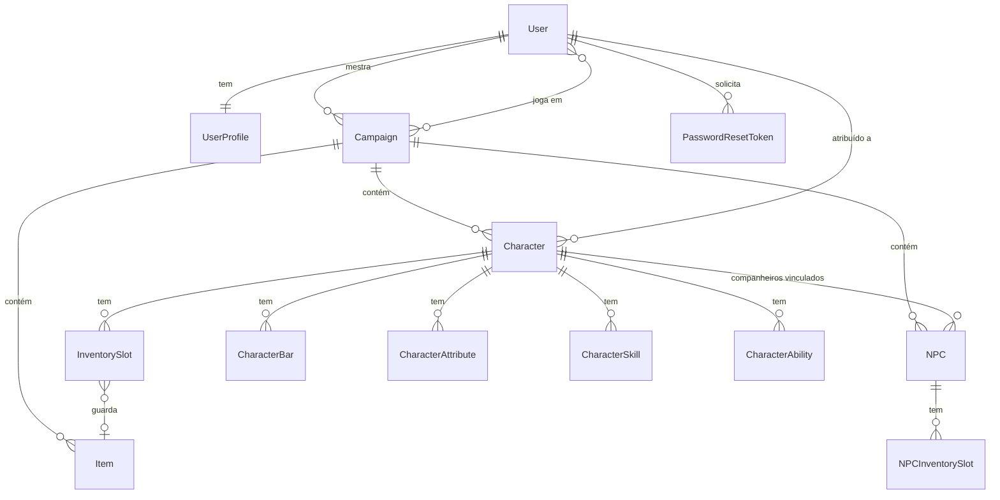

> 🇧🇷 **Português** · 🇬🇧 [English](data-model.md)

# Modelo de Dados

Todos os modelos vivem em `hud/models.py`. Tudo está no escopo de uma **campanha**, que é a raiz de agregação do domínio.



## Campaign

O contêiner do qual todo o resto pendura.

| Campo | Observações |
|---|---|
| `name`, `description` | |
| `banner` | Imagem opcional (`campaigns/`) |
| `master` | FK para usuário — **a única conta com direito de edição** |
| `players` | M2M para usuários; o mestre é adicionado automaticamente na criação |
| `created_at`, `updated_at` | Ordenado do mais recente para o mais antigo |

Excluir uma campanha cascateia para seus personagens, NPCs e itens — daí a confirmação pelo nome exato na interface.

## UserProfile

Criado automaticamente por um signal `post_save` em `User`.

| Campo | Observações |
|---|---|
| `role` | `MASTER` / `PLAYER` — **legado**, a autorização real é por campanha |
| `display_name` | Nome completo exibido na interface |
| `nickname` | Usado pela busca de jogadores |
| `avatar` | Imagem opcional (`avatars/`) |

## Character e NPC

`Character` e `NPC` são estruturalmente gêmeos — mesmos atributos, mesma mecânica de inventário, mesmas subentidades de ficha. Diferem na propriedade e na visibilidade padrão:

| | Character | NPC |
|---|---|---|
| Pertence a | Campanha | Campanha |
| Controlado por | Um jogador (`assigned_to`) | O mestre |
| `visible` padrão | `True` | `False` |
| Vínculo extra | — | `assigned_to_character` (companheiro de um personagem) |

Campos compartilhados: `name`, `image`, `image_zoom`/`image_focus_x`/`image_focus_y`, `hp_max`/`hp_current`, `sp_max`/`sp_current`, `inventory_capacity` (padrão 16), `created_by`, timestamps.

Os três campos de imagem vêm da classe abstrata `RetratoEnquadrado` e guardam o **enquadramento** do retrato: o zoom (100 a 400) e o ponto da foto que fica no centro da moldura (0 a 1 em cada eixo). Sem eles a moldura teria que cortar pelo meio, e o meio geométrico quase nunca é o rosto. O corte fica no banco, e não no navegador de quem enviou, porque o jogador precisa ver a ficha no mesmo enquadramento que o mestre escolheu. Trocar a foto devolve os três ao padrão: o corte é da imagem antiga.

Três invariantes são garantidos no `save()`:

- **`clamp_stats()`** — `hp_current` e `sp_current` nunca podem exceder seus máximos, não importa o que um formulário ou endpoint envie.
- **`clamp_framing()`** — o zoom fica entre 100 e 400 e o ponto entre 0 e 1.
- **`ensure_slots()`** — o inventário sempre tem exatamente `inventory_capacity` slots (veja abaixo).

> Os campos `hp_*` / `sp_*` são o sistema original de atributos. A migração `0010_migrate_hp_sp_to_bars` os moveu para o sistema genérico de **barras**; as colunas são mantidas por compatibilidade com os dados existentes e com os endpoints `modify_hp` / `modify_sp`.

## Subentidades da ficha

Cada uma delas existe em uma versão `Character…` e uma `NPC…`, todas ordenadas por `order` e depois `name`:

| Modelo | Campos | Propósito |
|---|---|---|
| `…Bar` | `name`, `current`, `max_value`, `color` | Recursos personalizados (HP, mana, sanidade…) |
| `…Attribute` | `name`, `value` | Atributos livres (FOR, DES…) |
| `…Skill` | `name`, `value` (opcional) | Perícias |
| `…Ability` | `name` | Habilidades nomeadas |

Os valores são `CharField`, não números, de propósito: sistemas diferentes escrevem atributos como `18`, `+3` ou `d8`, e o painel não os interpreta.

## Enemy

`Enemy` é a terceira ficha, e a mais curta: mesmo retrato enquadrado, mesmas barras, atributos, perícias e habilidades de `Character` e `NPC` — **sem inventário**. Inimigo não carrega mochila; o que ele deixa cair vira item da campanha pela mão do mestre. Não tem `inventory_capacity`, não tem `ensure_slots()`, não tem tabela de slots.

Também não herda os campos `hp_*`/`sp_*`: eles só existem nas outras duas por compatibilidade com os dados anteriores às barras, e uma ficha nova não precisa carregar essa dívida.

Nasce com `visible = False`. Quem revela é o mestre, quando quer que a mesa veja a barra de vida do que está na frente dela; enquanto está escondido, o jogador leva 403 mesmo sendo da campanha. As subentidades (`EnemySkill`, `EnemyAbility`, `EnemyBar`, `EnemyAttribute`) seguem o mesmo formato das de NPC.

## O quadro da campanha

O mestre arruma a sessão num quadro: personagens, NPCs, inimigos e polaroids ficam onde ele largou, e as barras de todos sobem e descem sem sair dali.

A posição vem da classe abstrata `PecaDoQuadro` (`board_x`, `board_y`), herdada por `Character`, `NPC`, `Enemy` e `Polaroid`. É **fração do quadro (0 a 1), não pixel**: o mestre arruma no monitor grande e o mesmo arranjo continua de pé no notebook. `NULL` quer dizer "nunca foi arrastada" — a view distribui essas em grade ao abrir, sem gravar nada; a posição só vira número no banco quando alguém arrasta de verdade.

`Polaroid` é a peça que não é ficha de ninguém: o mapa da masmorra, o bilhete que o ladrão deixou. Tem imagem (com o mesmo enquadramento das fichas), legenda e `tilt` — a inclinação em graus, entre −8 e 8. Ela fica no banco em vez de sair de um `random` no CSS porque um quadro que embaralha os ângulos a cada F5 cansa de olhar.

`StickyNote` é o post-it: só texto, escrito no lugar. Nasce vazio, sem formulário — o post-it existe para o que o mestre lembrou no meio da sessão e não quer perder, e o caminho entre lembrar e escrever tem que ser um clique. O texto salva sozinho (espera de 700 ms, e no `blur`); guarda `color` (uma das quatro da lista, girando na criação em vez de sorteada, porque duas seguidas iguais parecem bug) e `tilt` entre −6 e 6.

O quadro é só do mestre: a aba inteira vive dentro do bloco ``, então o HTML do jogador nem chega a conter as peças, e `?mode=player` também não as monta. E só entra nele o que já está revelado (`visible=True`) — enquanto a mesa não pode ver aquilo, não está em jogo, e o mestre mexe no que ainda é segredo na aba do tipo dele.

Os botões de barra mandam `amount` junto de `action`, e os três endpoints (`modify_bar`, `modify_npc_bar`, `modify_enemy_bar`) andam esse tanto — com piso em 1, senão um `amount` negativo inverteria a ação e `decrease` curaria.

## Item e slots de inventário

`Item` tem escopo de campanha e é compartilhado: a mesma linha de item pode estar em vários inventários, porque os slots a referenciam por FK.

`InventorySlot` / `NPCInventorySlot`:

| Campo | Observações |
|---|---|
| `character` / `npc` | Dono |
| `position` | Começa em 1; `unique_together` com o dono |
| `item` | Anulável — `SET_NULL`, então excluir um item esvazia o slot em vez de destruí-lo |

Os auxiliares de layout (`row`, `col`) derivam a posição na grade a partir de `INVENTORY_COLUMNS = 4`, e é por isso que a interface renderiza uma grade de 4 colunas sem armazenar coordenadas.

### O contrato de `ensure_slots()`

```python
existing = set(self.slots.values_list("position", flat=True))
missing  = [p for p in range(1, self.inventory_capacity + 1) if p not in existing]
# bulk_create(missing, ignore_conflicts=True)
# depois: apaga os slots com position > inventory_capacity
```

Consequências que vale conhecer:

- Os slots são **sempre** materializados no banco, nunca renderizados como placeholders virtuais — o template pode iterar `character.slots` diretamente.
- **Reduzir a capacidade apaga os slots excedentes**, e qualquer item que estivesse neles é desatribuído (a linha do `Item` em si sobrevive).
- O método pode ser chamado repetidamente com segurança (`ignore_conflicts=True`).

## PasswordResetToken

| Campo | Observações |
|---|---|
| `user` | FK |
| `token` | String aleatória única usada na URL de redefinição |
| `created_at`, `expires_at` | Validade verificada no momento do resgate |
| `used` | Flag de uso único |

Os tokens nunca são apagados após o uso, o que deixa uma trilha de auditoria das tentativas de redefinição.
